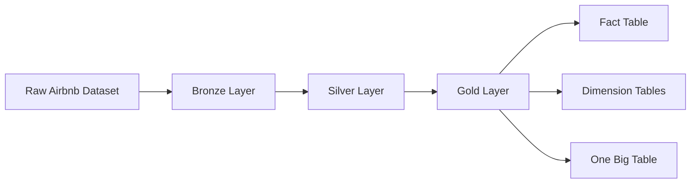
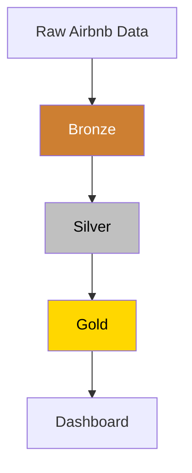
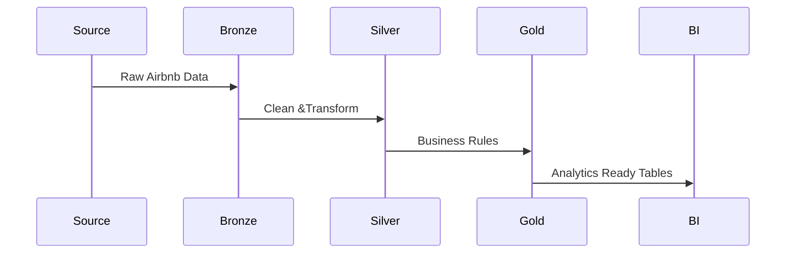

Perfect! We'll build it section by section. Here's **Part 1** of your professional `README.md`.

> Paste this at the beginning of your `README.md`. I'll provide **Part 2** next.

````markdown
# 🏠 Airbnb Data Pipeline using dbt & Snowflake

<p align="center">


</p>

<p align="center">

# End-to-End ELT Pipeline using dbt & Snowflake

Transforming raw Airbnb data into analytics-ready datasets using the Medallion Architecture.

</p>

---

# 📖 Overview

This project demonstrates a modern **Data Engineering ELT pipeline** built using **dbt Core** and **Snowflake**.

The pipeline ingests raw Airbnb datasets, transforms them through multiple layers following the **Medallion Architecture**, and produces analytics-ready datasets for reporting and business intelligence.

The project showcases industry-standard data engineering practices including:

- Incremental Models
- Data Cleaning
- Data Transformation
- Slowly Changing Dimensions (SCD Type 2)
- Snapshot Management
- Fact & Dimension Modeling
- Modular SQL Development
- Version Control using Git

---

# 🚀 Tech Stack

| Technology | Purpose |
|------------|---------|
| ❄️ Snowflake | Cloud Data Warehouse |
| 🏗 dbt Core | Data Transformation |
| 📝 SQL | Data Modeling |
| 🐍 Python | Runtime Environment |
| 📄 YAML | Snapshot Configuration |
| 🔄 Git | Version Control |
| 🐙 GitHub | Source Code Repository |

---

# 🏗 Solution Architecture



---

# 🥇 Medallion Architecture



---

# 📂 Repository Structure

```text
Airbnb_DBT_Snowflake
│
├── models
│   │
│   ├── Bronze
│   │     bronze_bookings.sql
│   │     bronze_hosts.sql
│   │     bronze_listings.sql
│   │
│   ├── Silver
│   │     silver_bookings.sql
│   │     silver_hosts.sql
│   │     silver_listings.sql
│   │
│   └── Gold
│         fact.sql
│         obt.sql
│
├── snapshots
│     dim_bookings.yml
│     dim_hosts.yml
│     dim_listings.yml
│
├── macros
│
├── dbt_project.yml
│
├── README.md
│
└── profiles.yml
```

---

# 🔄 Pipeline Flow



---

# 📌 Data Engineering Workflow

```text
Source Data

      │

      ▼

Bronze Layer

(Ingestion)

      │

      ▼

Silver Layer

(Data Cleaning)

      │

      ▼

Gold Layer

(Data Modeling)

      │

      ▼

Fact Tables

Dimension Tables

OBT

      │

      ▼

Business Intelligence
```

---

# 🥉 Bronze Layer

The Bronze layer stores the raw Airbnb datasets with minimal transformations.

### Responsibilities

- Read source tables
- Incremental data loading
- Preserve raw data
- Improve pipeline performance

### Models

- bronze_bookings.sql
- bronze_hosts.sql
- bronze_listings.sql

### Features

✅ Incremental Models

✅ Faster execution

✅ Raw historical storage

---

# 🥈 Silver Layer

The Silver layer applies cleansing and business logic to the Bronze datasets.

Typical transformations include:

- Null handling
- Data standardization
- Column renaming
- Derived columns
- Business calculations

### Models

- silver_bookings.sql
- silver_hosts.sql
- silver_listings.sql

---

## Booking Transformations

Examples:

- Total Booking Amount
- Stay Duration
- Standardized Date Formats
- Derived Metrics

---

## Host Transformations

Business Logic Example

| Response Rate | Category |
|--------------|----------|
| >95 | Excellent |
| 80–95 | Good |
| 60–80 | Fair |
| <60 | Poor |

---

## Listing Transformations

Examples include

- Price Standardization
- Property Type Cleaning
- Availability Formatting
- Derived Price Categories

---
````

In the next message, I'll provide **Part 2**, which includes the **Gold layer, dbt Snapshots, model lineage, installation, commands, skills, future improvements, author section, and a polished footer**.
